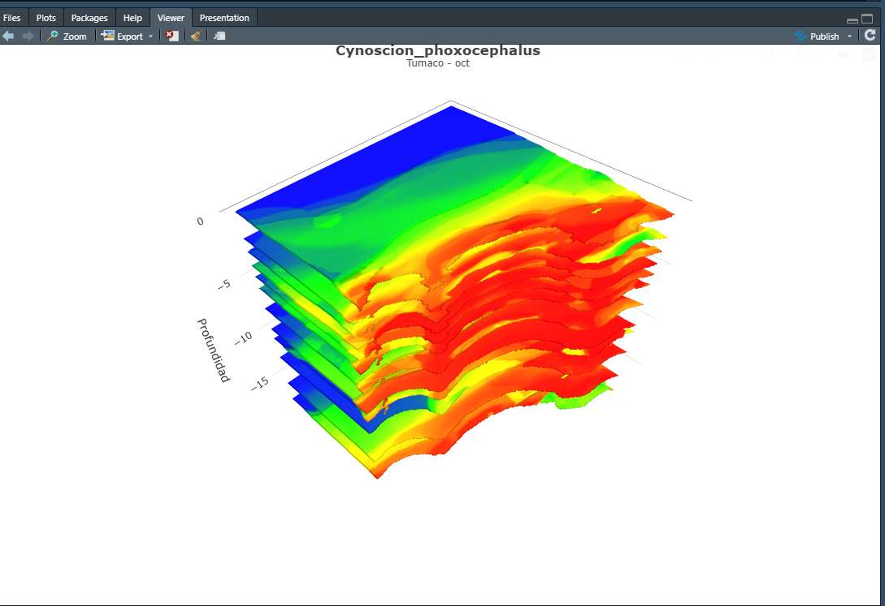

# plotly_3DSurface

## Requirements

- R Project (https://www.r-project.org/)
- R Studio (https://www.rstudio.com/)
### Packages
- raster (https://cran.r-project.org/web/packages/raster/index.html)
- plotly (https://plotly.com/r/)

## Demo

- [Live Demo ] (http://165.22.189.197/test/tumaco_cynoscion_phoxocephalus_oct.html)

## Screenshot 

## Credits

- [Andres Herrera](https://github.com/AndresHerrera/)

